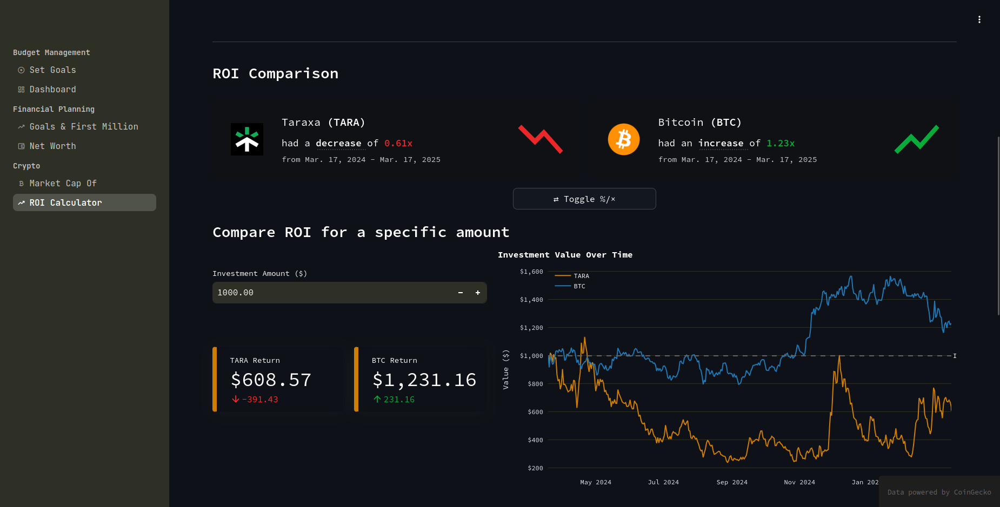
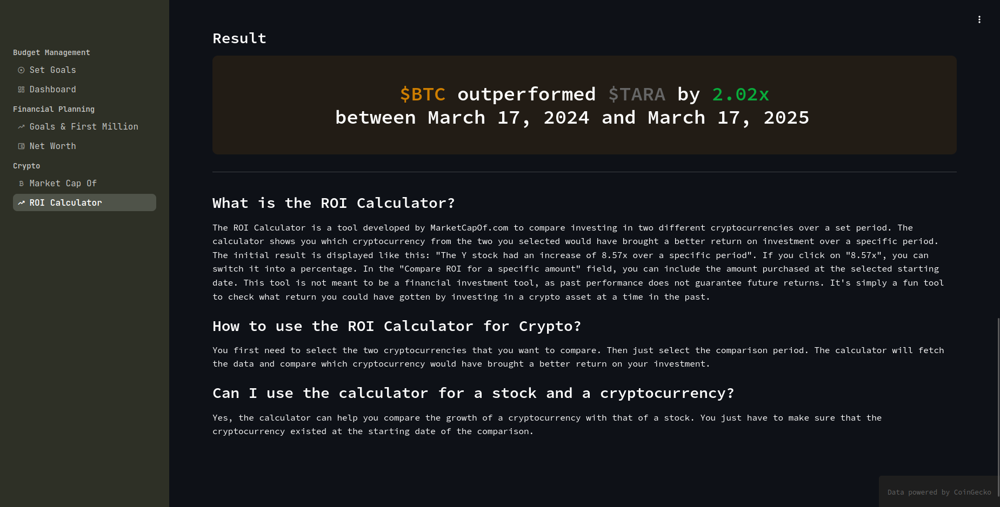
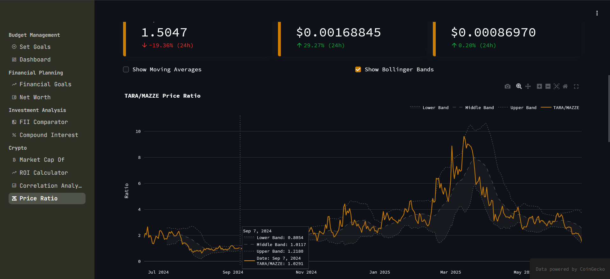

# FinStream

## Overview
FinStream is a simple and interactive personal finance dashboard built with Streamlit. It helps users manage their budget, set financial goals, track net worth, and visualize financial progress.






## Features
- **Budget Tracker**: Log income and expenses, visualize spending trends.
- **Goals & First Million**: Set financial targets and estimate time to reach your first million.
- **Assets vs Liabilities**: Track net worth by managing assets and debts.

## Project Structure
```
finstream/
├── src/                    # Source code
│   ├── app.py             # Main Streamlit application
│   ├── config.py          # Configuration file
│   ├── components/        # App Components Collecations
│   ├── models/            # Data models
│   ├── crypto/            # Crypto Related Pages
│   ├── budget/            # Budget Related Pages
│   ├── services/          # Edge Services (Integrations with external APIs, Ex: Coingecko & YFinance Clients)
│   └── utils/             # Helper functions
├── .streamlit/
│   └── config.toml
├── data/                 # Persistent Database file (.json, .csv, SQLite)
├── requirements.txt      # Project dependencies
└── README.md
```

## Installation
1. Clone the repository:
   ```bash
   git clone https://github.com/0xthiagomartins/finstream.git
   cd finstream
   ```
2. Set up a virtual environment and install dependencies:
   ```bash
   python -m venv venv
   source venv/bin/activate  # On Windows use `venv\Scripts\activate`
   pip install -r requirements.txt
   ```
3. Run the Streamlit app:
   ```bash
   streamlit run src/app.py
   ```

## Dependencies
- Python 3.11+
- Streamlit
- Pandas
- Matplotlib / Plotly
- yFinance & CoinGecko Clients